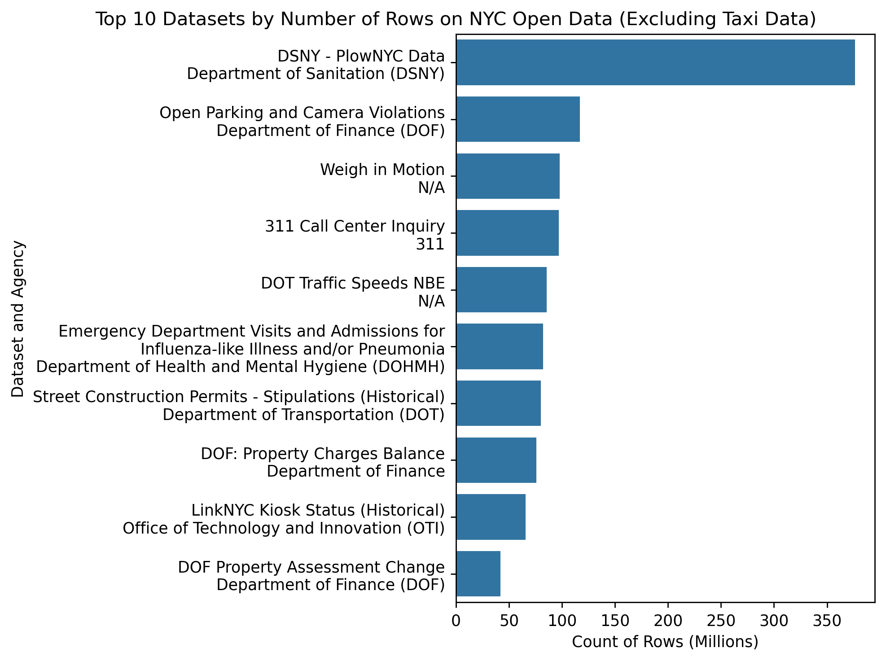

# NYC Open *Big* Data
Author: Mark Bauer

# Introduction

# NYC Open Data Summary Statistics

| Metric              |      Value |
|:--------------------|-----------:|
| Number of datasets  |       2491 |
| Number of agencies  |        201 |
| Number of rows      | 5965739051 |
| Number of views     |   27761756 |
| Number of downloads |   11529518 |

Table xx: Overview metrics of NYC Open Data

Figure xx: New Datasets per Year on NYC Open Data.

Figure xx: Top 10 Agencies with the Highest Median Number of Rows per Dataset on NYC Open Data

Figure xx: Top 10 Agencies with the Highest Total Number of Rows on NYC Open Data.

# Dataset Analysis

Figure xx: .

## Dataset with the Highest Number of Rows on NYC Open Data
| id        | name                | attribution                     |   count_rows |   viewCount |   downloadCount |
|:----------|:--------------------|:--------------------------------|-------------:|------------:|----------------:|
| rmhc-afj9 | DSNY - PlowNYC Data | Department of Sanitation (DSNY) |    376404531 |        1854 |             504 |

## Top 10 Datasets with the Highest Number of Rows on NYC Open Data

## Top 10 Datasets with the Highest Number of Rows on NYC Open Data (Excluding Taxi Data)

## Top 10 Datasets with the Highest Number of Rows on NYC Open Data (Only Taxi Data)

# Code 
- The code to calculate count of rows for each dataset is located in the [data-export.ipynb](https://github.com/mebauer/nyc-open-bigdata/blob/main/data-export.ipynb) notebook.
- Brief data cleaning before the analysis can be found in the [data-cleaning.ipynb](https://github.com/mebauer/nyc-open-bigdata/blob/main/data-cleaning.ipynb) notebook.
- The code to generate the figures can be found in the [analysis.ipynb](https://github.com/mebauer/nyc-open-bigdata/blob/main/analysis.ipynb) notebook.

# Data
Data was retrieved from [NYC Open Data](https://opendata.cityofnewyork.us/).

# Say Hello!
Feel free to reach out.
- LinkedIn: [markebauer](https://www.linkedin.com/in/markebauer/)   
- Portfolio: [mebauer.github.io](https://mebauer.github.io/)
- GitHub: [mebauer](https://github.com/mebauer)