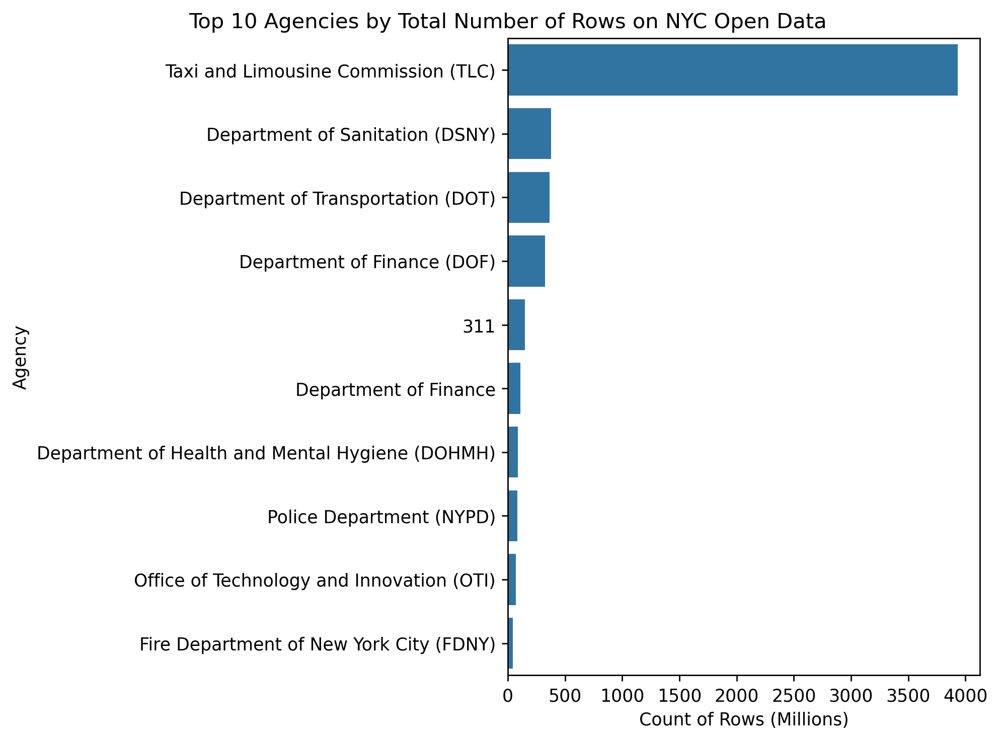

# NYC Open *Big* Data
Author: Mark Bauer

# Introduction
The Metropolitan Transportation Authority (MTA) recently released the 2023 and 2024 Subway Origin-Destination Ridership Estimates datasets on the New York State Open Data Portal. The 2023 dataset alone comprises approximately 116 million rows. While this dataset is fascinating, its massive size can pose challenges for users, even for experienced analyst and researchers. This prompted me to investigate the scale of the largest datasets available on NYC Open Data, and how users interact with these datasets compared to others.

In this project, I aim to address several key questions: Can open data include Big Data? If so, what characteristics define an optimal open big data platform? How can open big data benefit a broad range of producers and users? Which agencies produce the largest datasets, and what methods do they use to support users? How does the size of a dataset impact its usage?

To explore these questions, I examined the row counts, download counts, and view counts of datasets on NYC Open Data, with the goal of understanding how big data is implemented and utilized on this platform.

# NYC Open Data Summary Statistics

| Metric              | Value         |
|:--------------------|:--------------|
| Number of datasets  | 2,491         |
| Number of agencies  | 201           |
| Number of rows      | 5,965,739,051 |
| Number of views     | 27,761,756    |
| Number of downloads | 11,529,518    |

Table xx: Summary statistics of NYC Open Data.

Figure xx: Top 10 Agencies by Total Number of Rows on NYC Open Data.

Figure xx: Top 10 Agencies by Median Number of Rows on NYC Open Data.

Figure xx: Boxplots of Download Counts by Number of Rows on NYC Open Data.

Figure xx: Average Download Count with Error Bars on NYC Open Data.

# Dataset Analysis

| id        | name                | attribution                     |   count_rows |   viewCount |   downloadCount |
|:----------|:--------------------|:--------------------------------|-------------:|------------:|----------------:|
| rmhc-afj9 | DSNY - PlowNYC Data | Department of Sanitation (DSNY) |  376,404,531 |        1854 |             504 |

Table xx: Dataset with the Largest Number of Rows on NYC Open Data.

Figure xx: Top 10 Datasets by Number of Rows on NYC Open Data.

Figure xx: Top 10 Datasets by Number of Rows on NYC Open Data (Excluding Taxi Data).

Figure xx: Top 10 Datasets by Number of Rows on NYC Open Data (Only Taxi Data).

# Code 
- The code to calculate count of rows for each dataset is located in the [data-export.ipynb](https://github.com/mebauer/nyc-open-bigdata/blob/main/data-export.ipynb) notebook.
- Brief data cleaning before the analysis can be found in the [data-cleaning.ipynb](https://github.com/mebauer/nyc-open-bigdata/blob/main/data-cleaning.ipynb) notebook.
- The code to generate the figures can be found in the [analysis.ipynb](https://github.com/mebauer/nyc-open-bigdata/blob/main/analysis.ipynb) notebook.

# Data
Data was retrieved from [NYC Open Data](https://opendata.cityofnewyork.us/).

# Say Hello!
Feel free to reach out.
- LinkedIn: [markebauer](https://www.linkedin.com/in/markebauer/)   
- Portfolio: [mebauer.github.io](https://mebauer.github.io/)
- GitHub: [mebauer](https://github.com/mebauer)
