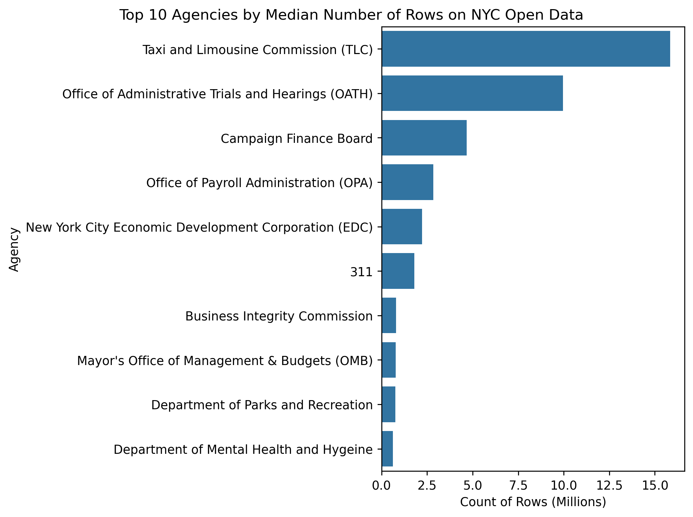
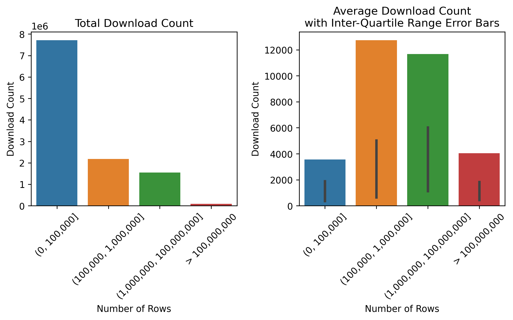

# Big Data on NYC Open Data
Author: Mark Bauer

# Introduction
The Metropolitan Transportation Authority (MTA) recently released the [2023 and 2024 Subway Origin-Destination Ridership Estimates](https://new.mta.info/article/introducing-subway-origin-destination-ridership-dataset) datasets on the New York State Open Data Portal. The 2023 dataset alone comprises approximately 116 million rows. While this dataset is fascinating, its massive size can pose challenges for users, even for experienced analysts and researchers. This prompted me to investigate the sizes of the largest datasets available on the [NYC Open Data](https://opendata.cityofnewyork.us/) Portal and how users interact with these datasets compared to others.

This project aims to:

1. **Investigate Dataset Sizes**: Examine the largest datasets available on the NYC Open Data Portal.
2. **Analyze Usage Patterns**: Analyze row counts, download counts, and view counts to understand how these large datasets are used.
3. **Explore Broader Implications**: Address broader questions such as whether open data can include Big Data? If so, what characteristics define an optimal open big data platform? How can open big data benefit a broad range of producers and users? Which agencies produce the largest datasets, and what methods do they use to support users?

# Overview of NYC Open Data

| Metric              | Value         |
|:--------------------|:--------------|
| Number of datasets  |         2,491 |
| Number of agencies  |           201 |
| Number of rows      | 5,965,739,051 |
| Number of views     |    27,761,756 |
| Number of downloads |    11,529,518 |

Table xx: Summary statistics of NYC Open Data. Note: This analysis only includes datasets with asset type as *dataset* and the display type as *table*, as well as datasets with at least one row.

Figure xx: Top 10 Agencies by Total Number of Rows on NYC Open Data.

Figure xx: Top 10 Agencies by Median Number of Rows on NYC Open Data.

Figure xx: Boxplots of Download Counts by Number of Rows on NYC Open Data.

Figure xx: Average Download Count with Error Bars on NYC Open Data.

# Dataset Analysis

| id        | name                | attribution                     |   count_rows |   viewCount |   downloadCount |
|:----------|:--------------------|:--------------------------------|-------------:|------------:|----------------:|
| rmhc-afj9 | DSNY - PlowNYC Data | Department of Sanitation (DSNY) |  376,404,531 |       1,854 |             504 |

Table xx: Dataset with the Largest Number of Rows on NYC Open Data.

Figure xx: Top 10 Datasets by Number of Rows on NYC Open Data.

Figure xx: Top 10 Datasets by Number of Rows on NYC Open Data (Excluding Taxi Data).

Figure xx: Top 10 Datasets by Number of Rows on NYC Open Data (Only Taxi Data).

# Implications
## The User Journey: Exporting Data on NYC Open Data
There are two main methods to exporting a dataset on NYC Open Data: 1) Download files locally and 2) utilize the Socrata Open Data API (SODA API):

1) Download Files Locally: You can download tabular data in various formats, including JSON, CSV, RDF, RSS, TSV, and XML. For geospatial data, additional formats such as KML, KMZ, Shapefile, and GeoJSON are also available.

2) Socrata Open Data API (SODA API): The [SODA API](https://dev.socrata.com/docs/endpoints) provides access via unique URLs, known as endpoints, that represent datasets or individual records. The API follows the REST (REpresentational State Transfer) design pattern, using HTTP methods for CRUD (Create, Read, Update, Delete) operations. It supports querying and filtering through the Socrata Query Language (SoQL), which is a SQL-like language tailored for web data. Note that for performance reasons, SODA APIs are paged and return a maximum of 50,000 records per page. More information on SODA API endpoints is available.

Limitations: The methods mentioned above have some limitations. For instance, there is no support for columnar file formats such as [Parquet](https://parquet.apache.org/), an open-source column-oriented file format optimized for efficient data storage and retrieval. Additionally, the SODA API can experience performance issues due to the overhead associated with HTTP requests and responses, particularly when querying large volumes of data.

## The Gold Standard: NYC Taxi and Limousine Commission (TLC)
As highlighted earlier, many of the largest datasets on NYC Open Data originate from the NYC Taxi and Limousine Commission (TLC). It’s no surprise that these Taxi Trip Datasets are commonly used in big data tutorials, and popular cloud services often provide them for free as sample data. In addition to hosting datasets (typically by year) on NYC Open Data, TLC also offers Parquet file formats on their website, which are distributed via Amazon Web Services (AWS), specifically using Amazon CloudFront.

These options cater to both types of users: those who prefer accessing data directly from NYC Open Data and those who opt for optimized Parquet files.

# Code 
- The code to calculate count of rows for each dataset is located in the [data-export.ipynb](https://github.com/mebauer/nyc-open-bigdata/blob/main/data-export.ipynb) notebook.
- Brief data cleaning before the analysis can be found in the [data-cleaning.ipynb](https://github.com/mebauer/nyc-open-bigdata/blob/main/data-cleaning.ipynb) notebook.
- The code to generate the figures can be found in the [analysis.ipynb](https://github.com/mebauer/nyc-open-bigdata/blob/main/analysis.ipynb) notebook.

# Data
Data was retrieved from [NYC Open Data](https://opendata.cityofnewyork.us/).

# Additional Resources

Socrata: NYC Open Data runs on the [Socrata Platform](https://dev.socrata.com/).
- [Socrata - Home](https://dev.socrata.com/)
- [Socrata System Architecture](https://open-source.socrata.com/architecture/): This blog post from SODA 2.0 was originally released in 2011.  

Note: Socrata was acquired by Tyler Technologies in 2018 and is now the Data and Insights division of Tyler.

NYC Open Data Portal
- [NYC Open Data Dashboard](https://opendata.cityofnewyork.us/dashboard/)
- [NYC Open Data Overview](https://opendata.cityofnewyork.us/overview/)
- [NYC Open Data Laws and Reports](https://opendata.cityofnewyork.us/open-data-law/)

NYC Taxi and Limousine Commission (TLC)
- [TLC Data](https://home.nyc.gov/site/tlc/about/data.page): Aggregate and Raw Data
- [TLC Trip Record Data](https://home.nyc.gov/site/tlc/about/tlc-trip-record-data.page)

# Say Hello!
Feel free to reach out.
- LinkedIn: [markebauer](https://www.linkedin.com/in/markebauer/)   
- Portfolio: [mebauer.github.io](https://mebauer.github.io/)
- GitHub: [mebauer](https://github.com/mebauer)
